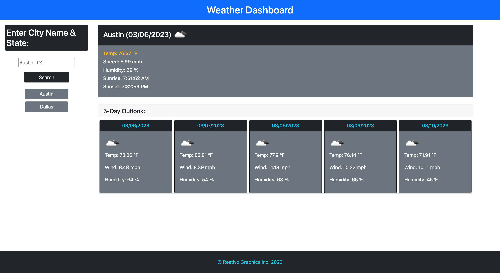

# DRR-06-Weather-App

## Description
This assignment had me build a Weather Dashboard App where one can search for a city and bring up current weather and a 5 day forecast. We utilized the get method from a web based API that allows us to search for data and retrieve specific data using a provided URL inserting the user inputs of City and State into the URL. This then retrieves that city's weather data - current and 5 day forecast. The app utilizes bootstrap for displaying the info on the html deployed page. It also stores the previous searches and creates a button for each that can be recalled from a press of the button - replacing the fields on the page.

## Links
https://github.com/davidrestivo/DRR-06-Weather-App

https://davidrestivo.github.io/DRR-06-Weather-App/

## Notes
I am catching up with this program that I originally had decided to use as one of my 2 misses. I decided to finish this program. 

## Screenshot

